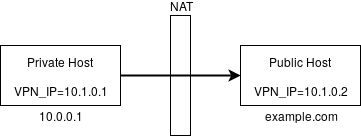
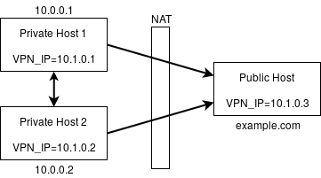
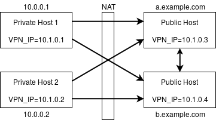

# PeerVPN for Docker [](https://hub.docker.com/r/thedrhax/peervpn)

This image is based on Alpine Linux and contains the latest build of [PeerVPN](https://peervpn.net/) -- the open source peer-to-peer VPN.

The main purpose of this image is making Docker Swarm or Rancher nodes behind NAT possible. Only one public server with one opened UDP port is required for this setup to work.

## Requirements

* /dev/net/tun device (`modprobe tun`)
* Container arguments:
  * `--device=/dev/net/tun`
  * `--cap-add=NET_ADMIN`
  * `--net=host` (optional, to get access to other nodes from the host machine)

## Environment variables

| Name | Default | Description |
| ---- | ------- | ----------- |
| `VPN_NAME` | peervpn | Name of the network. Must be the same on all nodes. |
| `VPN_KEY` | peervpn | Password. Must be the same on all nodes. |
| `VPN_PORT` | 7000 | UDP port that this node will listen on. |
| `VPN_INTERFACE` | vpn0 | Name of the TUN interface. Change it if you want to run multiple nodes on the same machine. |
| `VPN_IP` | | IP address of this node in the virtual network. |
| `VPN_CIDR` | 24 | Subnet prefix to use with VPN_IP. |
| `VPN_PEERS` | | List of known public peers (Example: `server1:7000 server2:7001`) |

## Examples

* One private host and one public host



```bash
# Public Host
docker run -d --device=/dev/net/tun --cap-add=NET_ADMIN --net=host \
           -p 7000:7000/udp \
           -e VPN_IP="10.1.0.2" \
           thedrhax/peervpn

# Private Host
docker run -d --device=/dev/net/tun --cap-add=NET_ADMIN --net=host \
           -e VPN_IP="10.1.0.1" \
           -e VPN_PEERS=example.com:7000 \
           thedrhax/peervpn
```

Wait a couple of seconds and try to ping 10.1.0.1 and 10.1.0.2 from each machine.

----

* Two private hosts and one public host



```bash
# Public Host
docker run -d --device=/dev/net/tun --cap-add=NET_ADMIN --net=host \
           -p 7000:7000/udp \
           -e VPN_IP="10.1.0.3" \
           thedrhax/peervpn

# Private Host 1
docker run -d --device=/dev/net/tun --cap-add=NET_ADMIN --net=host \
           -p 7000:7000/udp \
           -e VPN_IP="10.1.0.1" \
           -e VPN_PEERS="example.com:7000 10.0.0.2:7000" \
           thedrhax/peervpn

# Private Host 2
docker run -d --device=/dev/net/tun --cap-add=NET_ADMIN --net=host \
           -p 7000:7000/udp \
           -e VPN_IP="10.1.0.2" \
           -e VPN_PEERS="example.com:7000 10.0.0.1:7000" \
           thedrhax/peervpn
```

IPs 10.1.0.1, 10.1.0.2 and 10.1.0.3 should now be accessible from all hosts.

----

* Two private hosts and two public hosts (minimal config)



Each node must know about at least one public node. Here we use only public addresses as VPN_PEERS.

```bash
# Public Host 1
docker run -d --device=/dev/net/tun --cap-add=NET_ADMIN --net=host \
           -p 7000:7000/udp \
           -e VPN_IP="10.1.0.3" \
           -e VPN_PEERS="b.example.com:7000" \
           thedrhax/peervpn

# Public Host 2
docker run -d --device=/dev/net/tun --cap-add=NET_ADMIN --net=host \
           -p 7000:7000/udp \
           -e VPN_IP="10.1.0.4" \
           -e VPN_PEERS="a.example.com:7000" \
           thedrhax/peervpn

# Private Host 1
docker run -d --device=/dev/net/tun --cap-add=NET_ADMIN --net=host \
           -e VPN_IP="10.1.0.1" \
           -e VPN_PEERS="a.example.com:7000 b.example.com:7000" \
           thedrhax/peervpn

# Private Host 2
docker run -d --device=/dev/net/tun --cap-add=NET_ADMIN --net=host \
           -e VPN_IP="10.1.0.2" \
           -e VPN_PEERS="a.example.com:7000 b.example.com:7000" \
           thedrhax/peervpn
```
